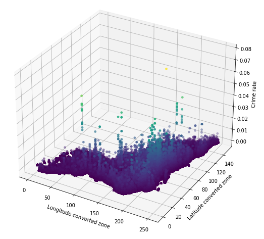
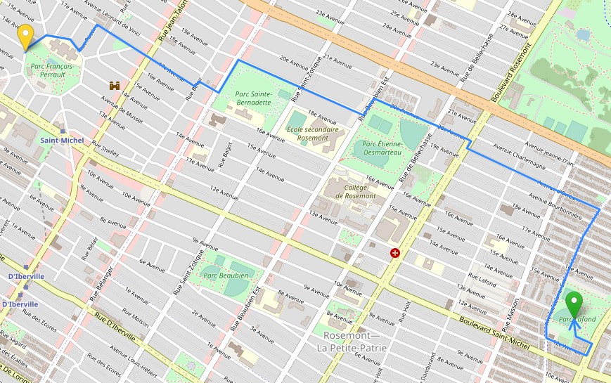
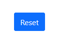

# Safe map for Montréal citizens

## Overview

This project is used to find the shortest and safest path possible on the island of Montreal. To do so, we are offering our users a Website in which they can select a starting and endpoint. The shortest path will be found by a weighted A* Heuristic Search algorithm. With weights representing the probability of a crime to happen as well as some user input. The feeling of being safe being something unquantifiable, we decided to use a Machine Learning algorithm to estimate the weights. This Machine Learning Algorithm is at first using the input from past crimes that happened on the island to predict a likelyhood that a crime happens again. We will then be requiring the users input to improve the feeling of safety of our users with their feedback.

We deployed our app on Heroku, here is the website of this app: https://safer-montreal-app.herokuapp.com/

**Disclaimer**: This project is made to improve the life of Montreal citizens. However, we are not responsible for your safety when you are using this app.

If you represent the probability of a crime to happen in terms of elevation, avoiding crimes would be like finding a path that reduces the amount of elevation gain:



 

## Explanations

In this section, we will go over the steps taken to reach the goal of the project. The steps described here is a retrospective of the steps taken so you can understand the principle of the project. Some of them where not made in this order and multiple iteration had to be done to reach the final result.

### Gather the data

The first step we took when starting this project was to find relevant data for what we wanted to do. We found pretty fast that we could have access to a [public dataset containing processed crimes](https://donnees.montreal.ca/ville-de-montreal/actes-criminels) that occurred on the island. The data is obfuscated to respect the privacy of potential victims, the location for example is the one of an intersection of street and not the exact location of the crime. We then decided to use some of the Geojson data available on the same website to find a way to obtain a path easily. We found the following [Geojson of Nodes](https://donnees.montreal.ca/ville-de-montreal/geobase-pole) as well as [Geojson of Edges](https://donnees.montreal.ca/ville-de-montreal/geobase-double). After some investigation we discovered that each edge connected two nodes, we decided then to use the edges to represent the Graph on which our A* algorithm will establish it's research.

### Create the Graph 

We already know that our A* algorithm will have to navigate upon a Graph. Basically our A* algorithm will go over the nodes and their neighbours to find the shortest path. We decide then to create a Graph class. 

When evaluating what would be needed we clearly see that we will be using the different `Nodes` representing the intersections on the island. The weight should then be represented by the probability of a crime happening. Although, it is clear from the start of the project that working with intersections is limiting. We decide then to create `Zones` or `Neighborhood` using a fixed step and the extremum of the latitude and longitude from our intersection. These `Zones` will then be flagged are safe or unsafe based on past data that was gathered. 

All of this processing is quite demanding in terms of complexity and processing time. This is why we decide to create a Json representation of our class. Basically once all our data is processed once, the Graph class is saved in a json format. Upon recreation of the class, you can use the already created json to drastically reduce the processing time.

### Create the model's data

We then understand that the data we will be using to train our Machine Learning Model and the data we currently possess are different. In fact, the data we want are related to user input, hopefully a user will not be victim of a crime for every movement done. Hence, we decide to create randomized data of a user moving around the different `zones` created at different `month` and `time` of the day. We then create a mathematical formula to estimate the probability of a crime happening based on the user input. This formula's results will be the target of our model. The first thing we notice is that it takes quite some time to calculate this formula (because it is based on a large past experience dataset). This results into the need of using GPU over CPU to go faster in the generation of the target, as well as a reinforcement into our idea to use a model (which would be faster in computing time once trained).

### Train the model

Once we have the data, we first decided to train a simple Neural Network on it as a first try while we were analyzing the data. The first results on multiple nodes were terrible but on single Nodes were pretty accurate, which proved we were doing something wrong. In fact, during the analysis of the data we discovered that our target was Zero-Inflated. Which proved to be difficult for our Neural Network to account for as it is a complex set of Weighted Sums which rarely results into 0. We then decided to have a `Two-Steps` approach. We first use a classifier which will tell us if our probability is 0 or not, followed by our Neural Network. We reach a high accuracy in both models, which prove that our approach is working well. We decide to save those models to reuse them later.

### A* Algorithm

One of the last step of the project is to implement the A* algorithm. The algorithm itself is standard and only uses the fact that we have a `Graph` object and `Model` object as well as `Node` object to work smoothly. The A* algorithm went through a lot of iteration in reality. As we wanted at first only to be moving from one `Zone` to another using the estimated probability. Then from one `Node` to another and finally using the probability estimated by our `Model` to judge if it is safe to move from one `Node` to another as well as if it is safe to stay in one `Zone` compared to another.

### Dash App

Finally, we needed to create a simple `Dash App` in which a user can select a `Departure` and a `Destination` (by clicking on the map) to move across Montreal Island in a safe way. 



The user can always update the `Destination` by clicking once again on the map. You can also use the `Reset Button` to change the `Departure` selection made.



## Other Information

#### Project organization
```bash
├── data                    # Public data gathered from [Montreal - Jeux de Donnees]
├── images                  # Buttons and example graphs for the path finder
├── notebooks               # Jupyter notebooks. Naming convention is a number (for ordering), the creator's initials, and a short - delimited description, e.g. 1.0-jqp-initial-data-exploration.
├── src
│   ├── algorithms          # The principle algorithms that will be used by our program.
│   │   ├── a_star.py
│   │   ├── model.py
│   ├── app
│   │   ├── app.py
│   │   ├── preprocess_data.py
│   ├── definations         # Basic Classes definitions of our objects.
│   │   ├── crime.py
│   │   ├── graph.py
│   │   ├── node.py
│   ├── exploration         # Some of the exploration that was done to understand the data we are working with. (geojson)
│   ├── features            # Used to generate the data necessary to train our model
│   │   ├── node_data.py
│   │   ├── preprocessing_graph.py
│   │   ├── target.py
├── model                   # Saved Decision tree and NN models and the corresponding scalers
│   ├── DT_MinMaxScaler.pkl
│   ├── NN_MinMaxScaler.pkl
│   ├── OneHotEncodingScaler.pkl
│   ├── best_nn.h5          # Best neural network model from grid search
│   ├── preprocessed_map_graph.json
├── Dockerfile              
├── Procfile          
├── .gitignore     
├── .slugignore          
├── requirements.txt
└── README.md               # The top-level README for developers using this project.
```

#### How to use venv

- create an env
```bash
virtualenv -p /usr/bin/python3 venv (MacOS)
virtualenv --python C:\Users\Public\anaconda\python.exe venv (Windows)
```

- use the env
```bash
source venv/bin/activate (MacOS)
.\venv\Scripts\activate (Windows)
```

- install everything from env
```bash
pip3 install -r requirements.txt
```

- install a package
```
pip3 install ___
pip3 freeze > requirements.txt
```

- clean cached data in docker
```commandline
docker buildx prune 
```

#### CopyRights

All rights are reserved by Jinling Xing and Luc Michea, no commercial usage.
